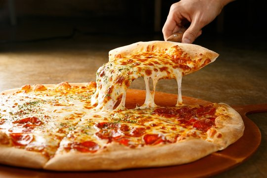

# Menu

## pizze klasyczne

|Lp. |Pizza:  |rozmiar: |30cm |50cm |60cm |
|---|--------------------------------------|---|-------------|--|--|
|1. |MARGHERITA (sos pomidorowy, ser, oregano)| |20zł| 40zł| 50zł|
|2. |CAPRICCIOSA (sos pomidorowy, ser, pieczarki)| | 22zł| 42zł| 52zł|
|3. |PEPPERONI (sos pomidorowy, ser, szynka, papryka, cebula, papryka pepperoni)|| 24z| 44zł| 54zł|
|4. |SALAMI (sos pomidorowy, ser mozzarella, salami)| | 23zł| 43zł| 53zł|
|5. |VESUVIO (sos pomidorowy, podwójny ser, szynka)| | 24zł| 44zł| 54zł|
|6. |KEBAB (sos pomidorowy, ser, kebab, sos czosnkowy)| | 26zł| 46zł| 56zł|
|7. |HAWAJSKA (sos pomidorowy, ser, szynka, ananas)| | 26zł| 46zł| 56zł|
|8. |QUATRO FROMAGGI (sos pomidorowy, 4 sery, oregano)| | 27zł| 47zł| 57zł|
|9. |GRECKA (sos pomidorowy, ser, oliwki, feta)| | 29zł| 49zł| 59zł|
|10. |BARBEQUE (sos pomidorowy, ser, kurczak, boczek, cebula, sos babreque, oregano)| | 30zł| 50zł| 60zł|

## pizze wegetarianskie 

|Lp. |Pizza:  |rozmiar: |30cm |50cm |60cm |
|---|--------------------------------------|---|-------------|--|--|
|1. |MARGHERITA (sos pomidorowy, ser, oregano)| |20zł| 40zł| 50zł|
|2. |CAPRICCIOSA (sos pomidorowy, ser, pieczarki)| | 22zł| 42zł| 52zł|
|3. |HAWAJSKA VEGE (sos pomidorowy, ser, ananas)|| 24z| 44zł| 54zł|
|4. |QUATRO FROMAGGI (sos pomidorowy, 4 sery, oregano)| | 27zł| 47zł| 57zł|
|5. |MILANO (sos pomidorowy, ser, papryka, oregano)| | 25zł| 45zł| 55zł|

## pizza calzone

|Lp. |Pizza:  |rozmiar: |30cm |50cm |60cm |
|---|--------------------------------------|---|-------------|--|--|
|1. |MARGHERITA (sos pomidorowy, ser, oregano)| |20zł| 40zł| 50zł|
|2. |CAPRICCIOSA (sos pomidorowy, ser, pieczarki)| | 22zł| 42zł| 52zł|
|3. |KEBAB (sos pomidorowy, ser, kebab, sos czosnkowy)| | 26zł| 46zł| 56zł|

## sałatki

1. Cesar (sałata, cebula, oliwa z oliwek, pomidor) - 15zł
2. Grecka (sałata, oliwki, feta, oliwa z oliwek, pomidor) - 20zł
3. Hiszpańska (sałata, oliwki, mozrella, oliwa z oliwek, pomidor) - 23zł

## sosy

1. Czosnkowy - 5zł
2. Pomidorowy - 5zł
3. Barbeque - 5zł
4. Majonezowy - 5zł
5. Chłopaki nie płaczą - 5zł

## napoje

|Lp. |Napój:  |Pojemność: |330ml |500ml |
|---|--------------------------------------|---|-------------|--|
|1. |Woda| |5zł| 7zł|
|2. |Sok owocowy| |7zł| 10zł| 
|3. |Coka-Cola| |7zł| 10zł|
|4. |Piwo jasne| |10zł| 15zł|
|5. |Piwo ciemne| |12zł| 17zł|
